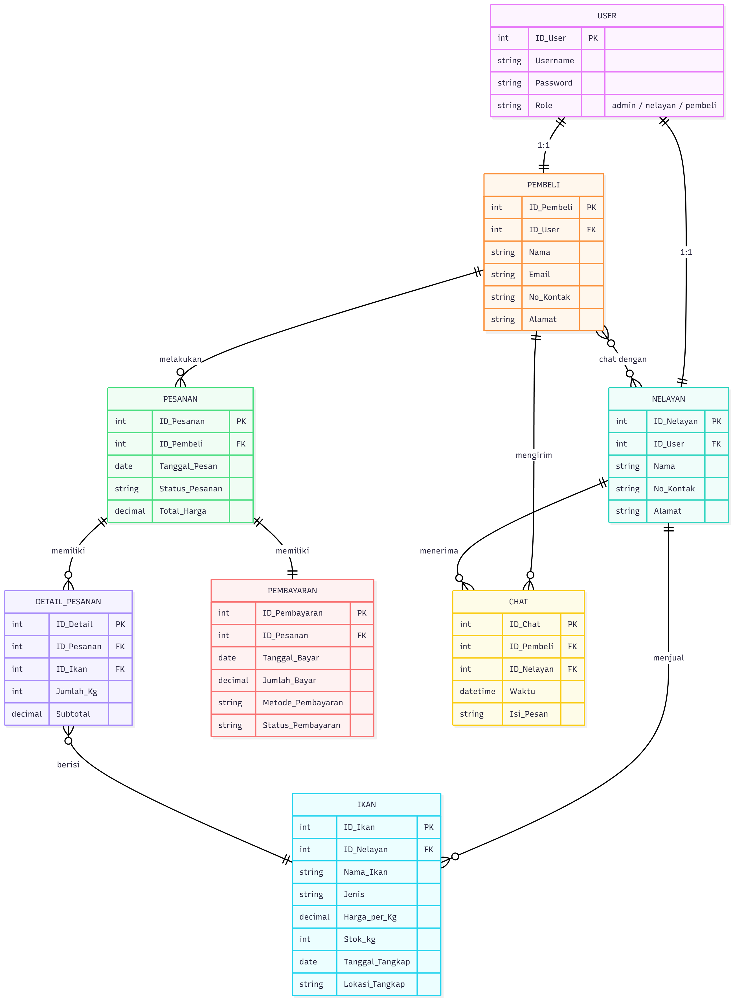

## 🐟 Entity Relationship Diagram (ERD) – IKAN SHOP (FISHMARK)

### 🎯 Deskripsi Umum

ERD ini menggambarkan struktur basis data sistem IKAN SHOP, yaitu platform jual beli ikan antara nelayan (produsen) dan pembeli (customer) dengan fitur transaksi, pembayaran, dan chat dua arah.
Desain ERD sudah melalui proses normalisasi hingga 3NF, memastikan data tidak redundan, konsisten, dan mudah dikelola.

### 🧩 Struktur dan Hubungan Antar Entitas

### 📘 Deskripsi Tiap Entitas

| **Entitas**        |	**Deskripsi**                                                                                                              |
|---------           |----------                                                                                                                   |
| **User**	         |Menyimpan data dasar pengguna seperti username, password, dan peran (role) apakah sebagai admin, nelayan, atau pembeli.      |
| **Nelayan**	      |Menyimpan informasi nelayan yang menjual ikan. Relasi 1:1 dengan User.                                                       |
| **Pembeli**	      |Menyimpan informasi pembeli yang melakukan transaksi pembelian ikan. Relasi 1:1 dengan User.                                 |
| **Ikan**	         |Berisi data ikan yang dijual oleh nelayan, termasuk harga, stok, dan lokasi tangkap.                                         |
| **Pesanan**	      |Menyimpan informasi transaksi yang dilakukan pembeli, termasuk tanggal dan status pesanan.                                   |
| **Detail_Pesanan**	|Menyimpan rincian setiap item dalam pesanan (jenis ikan, jumlah, dan subtotal).                                              |
| **Pembayaran**	   |Menyimpan data pembayaran pesanan, seperti tanggal, jumlah, dan metode pembayaran.                                           |
| **Chat**	         |Menyimpan percakapan antara pembeli dan nelayan (relasi M:N melalui tabel ini).                                              |

### 🔗 Ringkasan Relasi Antar Entitas
| **Relasi**               | **Kardinalitas** | **Keterangan**                              |
| :----------------------- | :--------------- | :------------------------------------------ |
| User → Nelayan           | 1 : 1            | Setiap nelayan memiliki satu akun user      |
| User → Pembeli           | 1 : 1            | Setiap pembeli memiliki satu akun user      |
| Nelayan → Ikan           | 1 : M            | Satu nelayan menjual banyak ikan            |
| Pembeli → Pesanan        | 1 : M            | Satu pembeli dapat membuat banyak pesanan   |
| Pesanan → Detail_Pesanan | 1 : M            | Setiap pesanan memiliki beberapa item ikan  |
| Detail_Pesanan → Ikan    | M : 1            | Tiap detail mengacu pada satu ikan tertentu |
| Pesanan → Pembayaran     | 1 : 1            | Satu pesanan memiliki satu pembayaran       |
| Pembeli ↔ Nelayan        | M : N            | Dapat saling chat melalui entitas Chat      |
